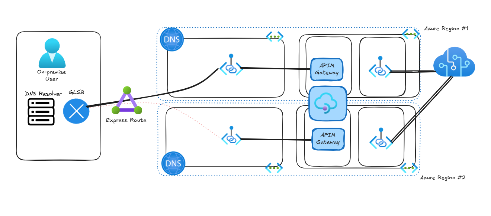

## Overview
This module currently is a work in progress.
 The AzureRM provider for Terraform does not support the creation of API Management instances with the `Standard v2` and `Premium v2` SKU.

## Networking options
Standard v2 and Premium v2 support virtual network integration to allow your API Management instance to reach API backends that are isolated in a single connected virtual network. The API Management gateway, management plane, and developer portal remain publicly accessible from the internet. The virtual network must be in the same region and subscription as the API Management instance. Learn more.

In preview, Standard v2 also supports inbound private endpoint connections to the API Management gateway.

Premium v2 also supports simplified virtual network injection for complete isolation of inbound and outbound gateway traffic without requiring network security group rules, route tables, or service endpoints. The virtual network must be in the same region and subscription as the API Management instance. Learn more.

# Links
https://learn.microsoft.com/en-us/azure/api-management/v2-service-tiers-overview#api-version
https://learn.microsoft.com/en-us/azure/api-management/private-endpoint?tabs=classic
https://github.com/hashicorp/terraform-provider-azurerm/issues/24377