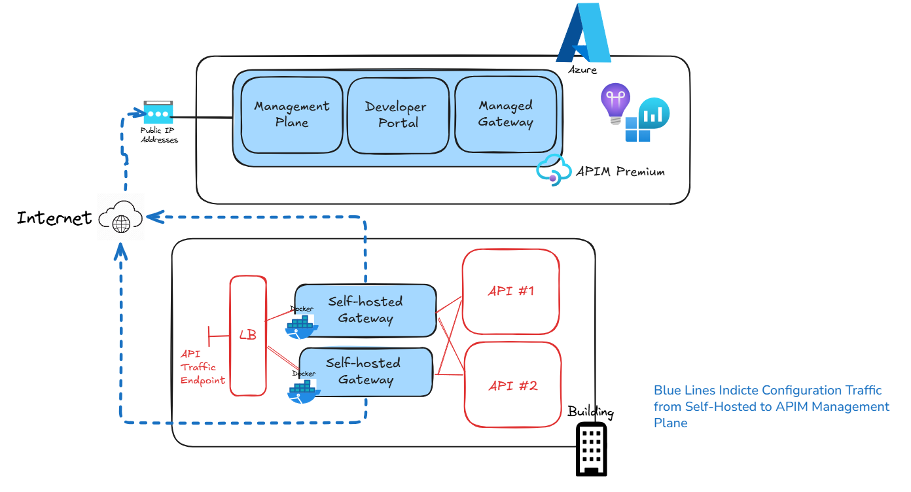
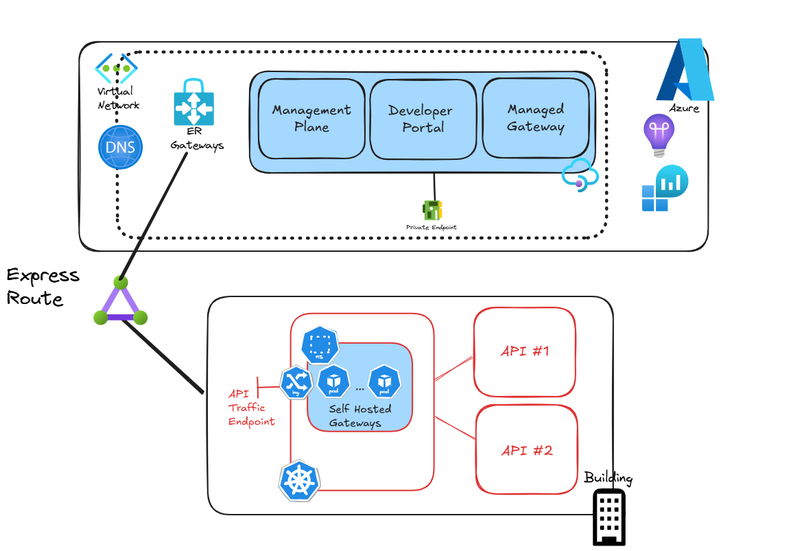
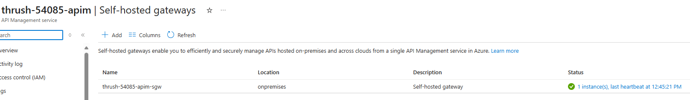
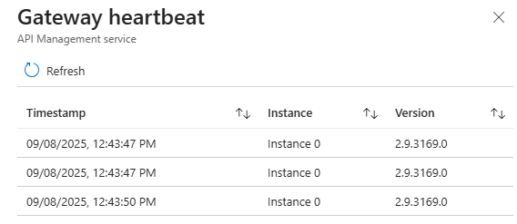
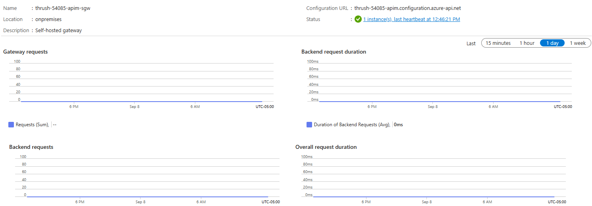

## Overview

This is a deployment of an Azure API Management instance with a self-hosted gateway running on AKS.

## High Level Architecture
]
***

## Kubernetes with

***


## Prerequisites
- An Azure subscription with Owner rights
- Entra ID permissions to create App Registrations
- An existing Azure Kubernetes Service (AKS) cluster. 
    * __[Basic Kubernetes Cluster Deployment](https://github.com/briandenicola/kubernetes/tree/main/aks/basic) for details__
- Azure CLI installed and configured.
- Terraform installed and configured.

## Taskfile Setup

Name | Usage | Location | Required | Default or Example Value
------ | ------ | ------ | ------ | ------
TAG | Value used in Azure Tags | taskfile.yaml | Yes | Azure External API Management Demo
DEFAULT_REGIONS | Default region to deploy to | taskfile.yaml | Yes | canadaeast
GW_LOCATION | Name of the Self-Hosted Gateway Location | taskfile.yaml | Yes |  onpremises
APIM_SKU | APIM SKU to Deploy (Developer or Premium) | taskfile.yaml | Yes | Developer

## Task Commands
* Running the `task` command without any options will run the default command. This will list all the available tasks.
    * `task init`               : Initialized Terraform modules
    * `task up`                 : Builds complete environment
    * `task down`               : Destroys all Azure resources and cleans up Terraform
    * `task apply`              : Applies the Terraform configuration 
    * `task refresh`            : Refreshes the Terraform configuration to update output values
    * `task deploy`             : Deploys the API to the API Management instance
    * `task gateway`            : Deploys Azure API Management Self-Hosted Gateway to AKS
    * `task creds`              : Creates Entra ID App Registration and Service Principal and saves details to local .env file

# Deployment
__Note:__ The deployment can take upwards of 45 minutes due to API Management.

## 1. Create Azure Resources
```bash
➜  External git:(main) ✗ task up
task: [up] terraform workspace new canadaeast || true
Created and switched to workspace "canadaeast"!

You're now on a new, empty workspace. Workspaces isolate their state,
so if you run "terraform plan" Terraform will not see any existing state
for this configuration.
task: [up] terraform workspace select canadaeast
task: [up] terraform init

Initializing the backend...
Initializing modules...
- azure_monitor in modules/observability

Initializing provider plugins...
- Finding hashicorp/azuread versions matching "~> 3.0"...
- Finding hashicorp/azurerm versions matching "~> 4.0"...
- Finding latest version of hashicorp/random...
- Finding latest version of hashicorp/http...
- Finding azure/azapi versions matching "~> 2.0"...
- Installing hashicorp/azurerm v4.43.0...
...
module.azure_monitor.data.azurerm_subscription.current: Read complete after 0s [id=/subscriptions/d208e58f-70cb-4616-a4d6-5ecf12b85faa]
azurerm_network_security_group.this: Creation complete after 3s [id=/subscriptions/d208e58f-70cb-4616-a4d6-5ecf12b85faa/resourceGroups/thrush-54085_rg/providers/Microsoft.Network/networkSecurityGroups/thrush-54085-default-nsg]
azurerm_user_assigned_identity.apim: Creation complete after 4s [id=/subscriptions/d208e58f-70cb-4616-a4d6-5ecf12b85faa/resourceGroups/thrush-54085_rg/providers/Microsoft.ManagedIdentity/userAssignedIdentities/thrush-54085-apim-identity]
module.azure_monitor.azurerm_resource_group.this: Still creating... [10s elapsed]
azurerm_virtual_network.this: Still creating... [10s elapsed]
azurerm_public_ip.apim: Still creating... [10s elapsed]
module.azure_monitor.azurerm_resource_group.this: Creation complete after 10s [id=/subscriptions/d208e58f-70cb-4616-a4d6-5ecf12b85faa/resourceGroups/thrush-54085-monitor_rg]
module.azure_monitor.azurerm_log_analytics_workspace.this: Creating...
azurerm_public_ip.apim: Creation complete after 11s [id=/subscriptions/d208e58f-70cb-4616-a4d6-5ecf12b85faa/resourceGroups/thrush-54085_rg/providers/Microsoft.Network/publicIPAddresses/thrush-54085-apim-pip]
azurerm_virtual_network.this: Creation complete after 11s [id=/subscriptions/d208e58f-70cb-4616-a4d6-5ecf12b85faa/resourceGroups/thrush-54085_rg/providers/Microsoft.Network/virtualNetworks/thrush-54085-vnet]
azurerm_subnet.compute: Creating...
azurerm_subnet.apim: Creating...
azurerm_subnet.pe: Creating...
...
module.azure_monitor.azurerm_application_insights.this: Creation complete after 29s [id=/subscriptions/d208e58f-70cb-4616-a4d6-5ecf12b85faa/resourceGroups/thrush-54085-monitor_rg/providers/Microsoft.Insights/components/thrush-54085-appinsights]
azurerm_api_management.this: Still creating... [40s elapsed]
azurerm_api_management.this: Still creating... [50s elapsed]
...
azurerm_role_assignment.apim_config_reader: Creation complete after 27s [id=/subscriptions/d208e58f-70cb-4616-a4d6-5ecf12b85faa/resourceGroups/thrush-54085_rg/providers/Microsoft.ApiManagement/service/thrush-54085-apim/providers/Microsoft.Authorization/roleAssignments/32debf1c-3b70-d54b-e4b1-48efa025d041]
azurerm_role_assignment.apim_config_validator_rg_scoped: Still creating... [30s elapsed]
azurerm_role_assignment.apim_config_validator_rg_scoped: Creation complete after 31s [id=/subscriptions/d208e58f-70cb-4616-a4d6-5ecf12b85faa/resourceGroups/thrush-54085_rg/providers/Microsoft.Authorization/roleAssignments/cdff9539-0d3f-d07e-505e-ac43c530cb67]

Apply complete! Resources: 26 added, 0 changed, 0 destroyed.

Outputs:

APIM_NAME = "thrush-54085-apim"
APP_NAME = "thrush-54085"
APP_RESOURCE_GROUP = "thrush-54085_rg"
AZURE_TENANT_ID = "4e462f08-083b-46c5-a26c-89c87ae55914"
SELF_HOSTED_GW_CLIENT_ID = "687dd301-b752-4dcb-8941-b7fb4fa8fb6e"
SELF_HOSTED_GW_NAME = "thrush-54085-apim-sgw"
SUBSCRIPTION_ID = "d208e58f-70cb-4616-a4d6-5ecf12b85faa"
```

## 2. Create Entra ID App Registration and Service Principal Credential File
__Note:__ The client secret is created with a expiration after 10 days.

```bash
➜  External git:(main) ✗ task creds
➡️Creating client secret for 687dd301-b752-4dcb-8941-b7fb4fa8fb6e in .env file . . .
```

## 3. Create Self-Hosted Gateway Object in APIM
```bash
➜  External git:(main) ✗ task gateway
task: [gateway] bash ./scripts/create-self-hosted-gateway.sh d208e58f-70cb-4616-a4d6-5ecf12b85faa thrush-54085_rg thrush-54085-apim onpremises thrush-54085-apim-sgw
➡️Creating Self-Hosted Gateway for thrush-54085-apim . . .
{
  "id": "/subscriptions/d208e58f-70cb-4616-a4d6-5ecf12b85faa/resourceGroups/thrush-54085_rg/providers/Microsoft.ApiManagement/service/thrush-54085-apim/gateways/thrush-54085-apim-sgw",
  "name": "thrush-54085-apim-sgw",
  "properties": {
    "description": "Self-hosted gateway",
    "heartbeat": null,
    "locationData": {
      "city": null,
      "countryOrRegion": null,
      "district": null,
      "name": "onpremises"
    }
  },
  "type": "Microsoft.ApiManagement/service/gateways"
}
```

## 4. Deploy Self-Hosted Gateway to AKS
```bash
➜  External git:(main) ✗ task deploy
task: [deploy] export APIM_NAME="thrush-54085-apim" ; export GW_CLIENT_ID="687dd301-b752-4dcb-8941-b7fb4fa8fb6e" ; export GW_CLIENT_SECRET="~~REDACTED~~" ; export AZURE_TENANT_ID="4e462f08-083b-46c5-a26c-89c87ae55914" ; export SELF_HOSTED_GW_NAME="thrush-54085-apim-sgw" ; envsubst < deploy/self-host-gateway.yaml.tmpl > deploy/self-host-gateway.yaml
task: [deploy] kubectl apply -f deploy/self-host-gateway.yaml
configmap/thrush-54085-apim-sgw-config created
service/thrush-54085-apim-sgw-svc created
service/thrush-54085-apim-sgw-instance-discovery created
deployment.apps/thrush-54085-apim-sgw created
```

## 4. Validate Deployment
```bash
➜  External git:(main) ✗ kubectl get pods
NAME                                     READY   STATUS    RESTARTS   AGE
thrush-54085-apim-sgw-55954c5784-skcg5   1/1     Running   0          75s
```
***

***

***


## 4. Validate Deployment
```bash
➜  External git:(main) task down
task: [down] az ad sp delete --id 687dd301-b752-4dcb-8941-b7fb4fa8fb6e --no-wait  || true
Command ran in 1.052 seconds (init: 0.250, invoke: 0.802)
task: [down] az group list --tag Application="Azure External API Management Demo" --query "[].name" -o tsv | xargs -ot -n 1 az group delete -y --verbose --no-wait -n || true
az group delete -y --verbose --no-wait -n thrush-54085_rg
Command ran in 2.091 seconds (init: 0.233, invoke: 1.858)
az group delete -y --verbose --no-wait -n thrush-54085-monitor_rg
Command ran in 3.461 seconds (init: 0.224, invoke: 3.237)
task: [down] rm -rf terraform.tfstate.d .terraform.lock.hcl .terraform terraform.tfstate terraform.tfstate.backup .terraform.tfstate.lock.info || true
```